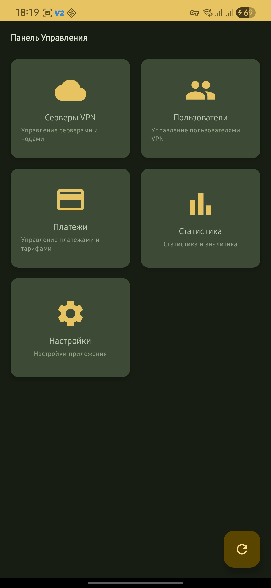
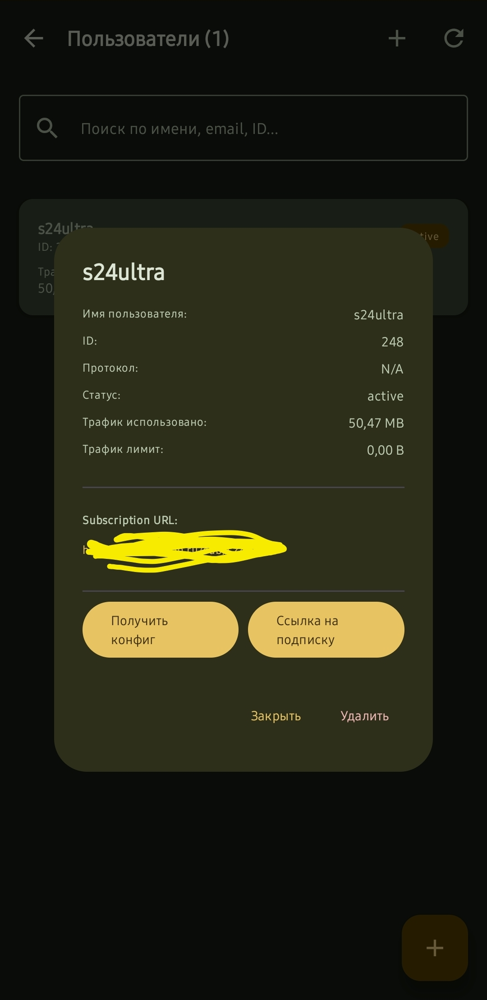
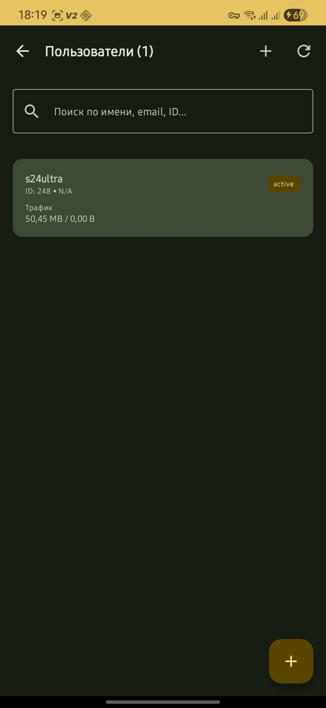
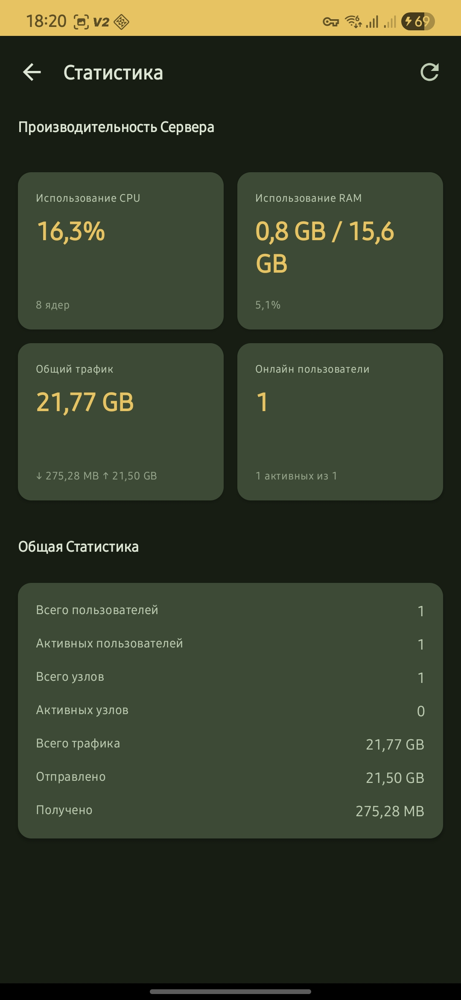
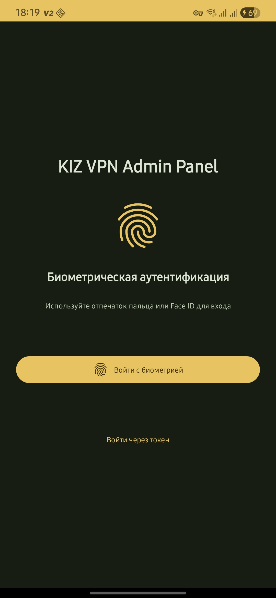

<div align="center">


# KIZ VPN Admin Panel

**Современная мобильная панель управления VPN сервером**

[](https://www.android.com/)
[](https://kotlinlang.org/)
[](https://developer.android.com/jetpack/compose)
[](LICENSE)

📖 **Languages:** [🇷🇺 Русский](README.md) | [🇬🇧 English](README.en.md)

---

</div>

---

## 📱 Описание

**KIZ VPN Admin Panel** — современное Android приложение для управления VPN серверами на базе PasarGuard Panel. Предоставляет полный функционал для администрирования VPN инфраструктуры прямо с вашего Android устройства.

## ✨ Возможности

### 👥 Управление пользователями
- Просмотр списка всех пользователей VPN
- Создание, редактирование и удаление пользователей
- Детальная статистика трафика для каждого пользователя
- Просмотр оставшихся дней подписки
- Получение конфигурационных файлов и subscription-ссылок
- Поиск и фильтрация пользователей

### 🖥 Управление серверами
- Мониторинг узлов (Nodes) VPN сети
- Просмотр настроенных входящих подключений (Inbounds)
- Статус и состояние серверов в реальном времени
- Управление серверами (перезагрузка)

### 💰 Платежи и биллинг
- Интеграция с PostgreSQL для учета платежей
- Список всех платежей с детальной информацией
- Фильтрация платежей по статусу и периоду
- Генерация QR-кодов для оплаты тарифов
- Статистика доходов по периодам

### 📊 Статистика и аналитика
- Мониторинг производительности сервера (CPU, RAM, трафик)
- Количество активных пользователей
- Общая статистика трафика сервера
- Визуализация данных в удобном формате

### 🔐 Безопасность
- Биометрическая аутентификация (отпечаток пальца/Face ID)
- Безопасное хранение токенов доступа в DataStore
- Защищенное соединение через HTTPS

### 🎨 Интерфейс
- Современный Material Design 3
- Темная тема
- Интуитивно понятная навигация
- Видео-интро при запуске
- Адаптивный дизайн для разных размеров экранов

## 📸 Скриншоты

<table>
<tr>
<td><br/><b>Dashboard</b></td>
<td><br/><b>Users</b></td>
<td><br/><b>Payments</b></td>
</tr>
<tr>
<td><br/><b>Statistics</b></td>
<td><br/><b>Login</b></td>
</tr>
</table>

## 🚀 Скачать

### Последний релиз

**Версия:** `v1.0.0`  
**Размер:** `~68 MB`  
**Минимальная версия Android:** `7.0 (API 24)`

[📥 Скачать APK](releases/KIZ-VPN-Panel-PUBLIC.apk)

> **Примечание:** Публичный APK требует настройки API сервера перед использованием. См. раздел "Настройка" ниже.

## 🛠 Технологии

- **Язык**: Kotlin
- **UI Framework**: Jetpack Compose
- **Архитектура**: MVVM (Model-View-ViewModel)
- **Сетевая библиотека**: Retrofit 2 + OkHttp
- **Локальное хранилище**: DataStore Preferences
- **Биометрия**: androidx.biometric
- **Видео**: ExoPlayer
- **Минимальная версия**: Android 7.0 (API 24)

## 📋 Требования

- **Android Studio**: Hedgehog | 2023.1.1 или новее
- **JDK**: 17 или выше
- **Android SDK**: API Level 34
- **Интернет**: требуется для работы с API

## ⚙️ Настройка

Перед использованием приложения необходимо настроить:

1. **API URL**: Введите адрес вашего PasarGuard API (например, `https://your-server.com/api`)
2. **JWT Token**: Укажите токен аутентификации

### Как получить JWT токен:

1. Откройте веб-панель PasarGuard в браузере
2. Войдите в систему с учетными данными администратора
3. Откройте DevTools (F12) → вкладка Network
4. Выполните любое действие в панели
5. Найдите запрос → Headers → найдите `Authorization: Bearer ...`
6. Скопируйте токен после `Bearer ` (это ваш JWT токен)

## 📦 Установка из исходников

1. Клонируйте репозиторий:
```bash
git clone https://github.com/eXLu51ve-gjj/kizvpn-admin-panel.git
cd kizvpn-admin-panel
```

2. Откройте проект в Android Studio

3. Настройте API конфигурацию (см. `SETUP_INSTRUCTIONS.md`)

4. Соберите проект:
```bash
./gradlew assembleDebug
```

APK файл будет находиться в `app/build/outputs/apk/debug/app-debug.apk`

## 📖 Использование

### Первый запуск

1. Запустите приложение
2. Введите URL вашего API сервера
3. Вставьте JWT токен доступа
4. Нажмите "Войти"

### Настройка биометрической аутентификации

1. Перейдите в "Настройки"
2. Включите переключатель "Биометрическая аутентификация"
3. При следующем входе используйте отпечаток пальца или Face ID

## 🏗 Архитектура проекта

```
app/
├── src/main/
│   ├── java/com/kizvpn/admin/
│   │   ├── data/              # Слой данных
│   │   │   ├── api/           # API клиенты (Retrofit)
│   │   │   ├── model/         # Модели данных
│   │   │   └── repository/    # Репозитории
│   │   ├── di/                # Dependency Injection
│   │   ├── ui/                # UI слой
│   │   │   ├── navigation/    # Навигация
│   │   │   ├── screens/       # Экраны (Composable)
│   │   │   └── viewmodel/     # ViewModels
│   │   └── util/              # Утилиты
│   ├── res/                   # Ресурсы
│   └── AndroidManifest.xml
└── build.gradle.kts
```

## 🤝 Вклад в проект

Мы приветствуем вклад в развитие проекта! Пожалуйста:

1. Форкните репозиторий
2. Создайте ветку для новой функции (`git checkout -b feature/amazing-feature`)
3. Зафиксируйте изменения (`git commit -m 'Add amazing feature'`)
4. Отправьте в ветку (`git push origin feature/amazing-feature`)
5. Откройте Pull Request

## 📄 Лицензия

Этот проект распространяется под лицензией [MIT License](LICENSE).

---

<div align="center">

**Made with ❤️ for VPN administrators**

[⭐ Star this repo](https://github.com/eXLu51ve-gjj/kizvpn-admin-panel) | [📝 Report Issue](https://github.com/eXLu51ve-gjj/kizvpn-admin-panel/issues) | [💡 Request Feature](https://github.com/eXLu51ve-gjj/kizvpn-admin-panel/issues)

</div>
